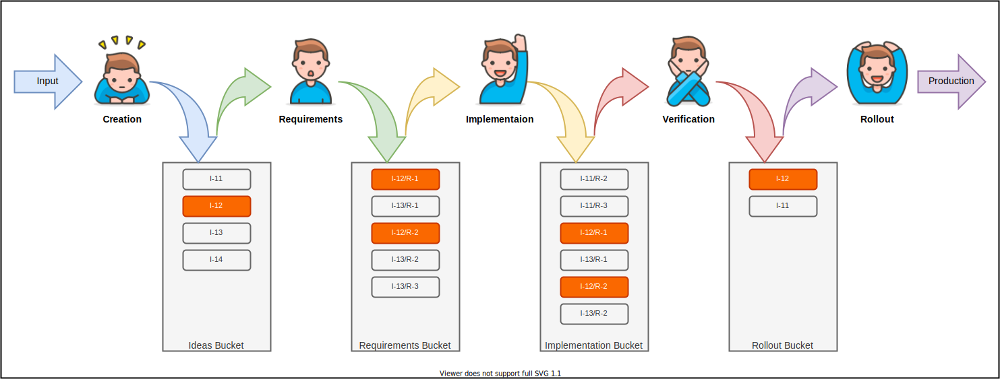
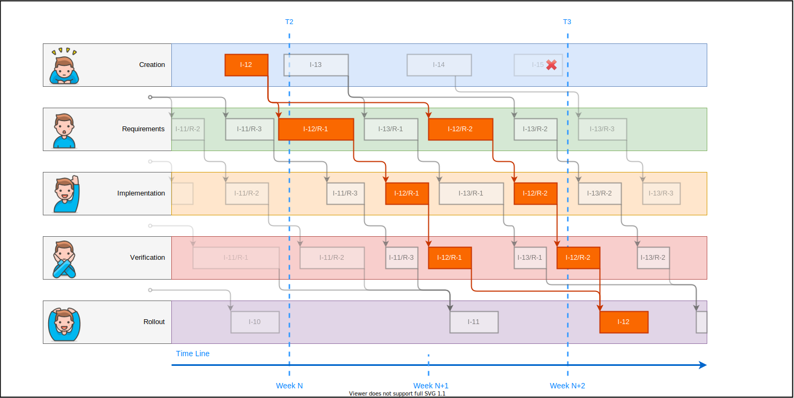

# Plot

Continuous Production is a flow production method.
This method allows to build most efficient process of transformation Idea into the Value within the software soultion lifecyle.
By efficiency time and money are considered.

For example:
If today PO will generate an idea on how to make customers bring more money.
What would be the most efficient process by which engineers may transform this idea in actual value that must be brought to the customers?

## Digression 
It is crucial to accept the fact that work can be done when it can be done and not earlier.

## Process Tracks

Actual process of transforming ideas into value may be spitted on 5 tracks.
Each track consumes input, performs work and produces output.
It is important to understand that work within each tracks occurs while there is something on input.

Let's take a look:

### Creation
At this track, basing on **Input** from business side or customers, **Ideas** are created.
Results of this track are placed in **Ideas Bucket** in order to be consumed by the next track.
This is creative process this why it's time line can not be predicted.

Cross-cutting example: based on dealers input PO decidedes to implement a scheduler that would allow to schedule appointments online. After discussion with SA, it has been decided to implement with O365 \ Exchange.

### Requirements
At this track, ideas are taken from **Ideas Bucket** and transformed into requirements.
Requirements contains exhaustive information, which is enough for engineers to implement and verify.
This information contains functional requirements, non function requirements and steps required to verify.
The results of this track is placed into **Requirements Bucket** in order to be consumed by the next track.

Cross-cutting example: PO works together with SA and LQA on exact requirements on how to implement functionality are created, test steps required to test functionality are created also.

### Implementation
On this track, requirements are taken from **Requirements Bucket** and implemented.
The results of this track are placed into **Implementation Bucket** in order to be consumed by the next track.
It is important to note that engineer which implement the requiremnts get more understanding by reading test cases on how they should perfom initial verification that they did everything right.

Cross-cutting example: LDE takes requirement, splits the work between engineers and implementes. Engineers perform initial verification that everything is done according to requirements.

### Verification
On this track, implementation is taken from **Implementation Bucket** and verifies against the requirements.
The goal of this track is to ensure that actual implementation meets all the requirements which were originally specified.
The results of this track are placed into **Rollout Bucket** in order to be consumed by the next track.

Cross-cutting example: LQE pefroms tests against the requirements and test cases. If only implementation meets PO expectations it is considered for rollout.

## Rollout
On this track, functionality which is ready to rollout is taken from **Rollout Bucket** and delivered to the consumers.

Cross-cutting example: functionality to schedule the appointments appears in the applications, education materials are prepared, users are informed about new possibilities.

## Buckets

It is important to understand why bucket instead of list is considered.
This happens because items for further processing may be taken based on different reasons, likely this is priority but it also may be logical dependency and other reasons.

## Process Visualization

Below is a visualization of the process of continuous production.

Visualization of the bare same process, but from another point of view.
At this visualization it's clear to see that no idle occurs, because each track takes next work to do whenever it is possible.

It is important to understand that there is no sense in trying to feet tasks in time boundaries.

At this point it should be clear that there is no sense in low level planing, because work occurs as soon as input occurs.
This is why it is important to have bucket full of ideas ready for the next step.

## Rule
There should be only one rule to follow, is that each constantly must have something on input.
